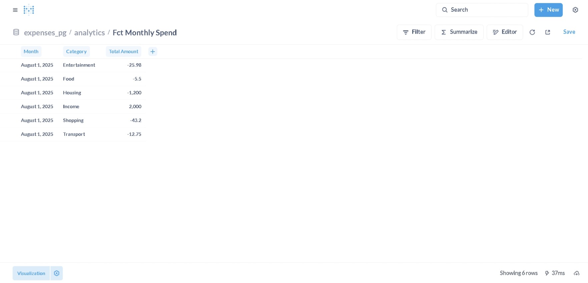

# 📊 Personal Expense Analytics Pipeline  

An **end-to-end batch ETL pipeline** that ingests raw CSV transaction data, cleans and enriches it with Python, loads into a **Postgres warehouse (Dockerized)**, transforms using **dbt**, and visualizes with **Metabase dashboards**.  

---

## 🚀 Features  
- **Python ETL**: Validates schema, cleans dates/amounts, categorizes merchants.  
- **Postgres Warehouse**: Structured schemas (`raw`, `analytics`) to separate raw vs curated data.  
- **dbt Models**:  
  - Staging model (`stg_transactions`) for cleaned data.  
  - Fact model (`fct_monthly_spend`) for monthly spend aggregation.  
- **Metabase Dashboards**: Interactive charts for category breakdown, monthly trends, and income vs expenses.  
- **Dockerized**: One command to spin up Postgres + Metabase.  

---

## 🛠 Tech Stack  
- **Python** (Pandas, SQLAlchemy, dotenv)  
- **Postgres** (via Docker)  
- **dbt** (data build tool, Postgres adapter)  
- **Metabase** (BI visualization, Dockerized)  
- **Docker Compose** (orchestration)  

---

## 📂 Project Structure  

```
expense-analytics-pipeline/
│
├── docker-compose.yml        # Postgres + Metabase setup
├── sql_init.sql              # Schema and table creation
├── etl.py                    # Python ETL script
├── requirements.txt          # Python dependencies
├── .env.example              # Template for DB credentials
├── README.md                 # Documentation
│
├── data/
│   └── raw/
│       └── bank_2025-08.csv  # Sample CSV
│
└── expenses_dbt/
    ├── dbt_project.yml
    └── models/
        ├── staging/
        │   ├── src_raw.yml
        │   └── stg_transactions.sql
        └── marts/
            └── fct_monthly_spend.sql
```

---

## ⚡ Quickstart  

### 1. Clone repo  
```bash
git clone https://github.com/<your-username>/expense-analytics-pipeline.git
cd expense-analytics-pipeline
```

### 2. Configure environment  
Copy `.env.example` → `.env` and update if needed:  
```bash
PG_HOST=localhost
PG_PORT=5432
PG_DB=expenses
PG_USER=expense_user
PG_PASSWORD=expense_pass
```

### 3. Start Postgres + Metabase  
```bash
docker compose up -d
```

- Postgres runs on port **5432**.  
- Metabase runs on port **3000** → open [http://localhost:3000](http://localhost:3000).  

### 4. Initialize database schema  
```bash
docker exec -it expenses_pg psql -U expense_user -d expenses -f /sql_init.sql
```

### 5. Install Python deps  
```bash
python3 -m venv venv
source venv/bin/activate
pip install -r requirements.txt
```

### 6. Run ETL script  
```bash
python etl.py
```

### 7. Run dbt models  
```bash
cd expenses_dbt
dbt run
```

### 8. Explore in Metabase  
- Connect to Postgres (host: `expenses_pg`, user: `expense_user`, db: `expenses`).  
- Build dashboards using `analytics.fct_monthly_spend`.  

---

## 📊 Example Outputs  

### Sample data (from CSV)  
```
08/01/2025,Netflix,-15.99
08/02/2025,Starbucks,-5.50
08/02/2025,Salary,2000.00
08/03/2025,Uber,-12.75
08/04/2025,Amazon,-43.20
08/04/2025,Rent,-1200.00
08/05/2025,Spotify,-9.99
```

### Fact table (`fct_monthly_spend`)  
| month      | category      | total_amount |
|------------|---------------|--------------|
| 2025-08-01 | Entertainment | -25.98 |
| 2025-08-01 | Food          | -5.50 |
| 2025-08-01 | Housing       | -1200.00 |
| 2025-08-01 | Income        | 2000.00 |
| 2025-08-01 | Shopping      | -43.20 |
| 2025-08-01 | Transport     | -12.75 |

### Example Metabase Dashboards  
- Here’s an example Metabase dashboard showing expenses by category and monthly trends:



---

## 📈 Future Improvements  
- Add dbt **tests** (unique, not_null).  
- Improve Python ETL with structured **logging** and error handling.  
- Add **scheduling** (cron/Airflow).  
- Extend with multiple months of CSVs for richer trend analysis.  

---

## 🤝 Contributing  
Feel free to fork and add more transformations, categories, or dashboards.  
